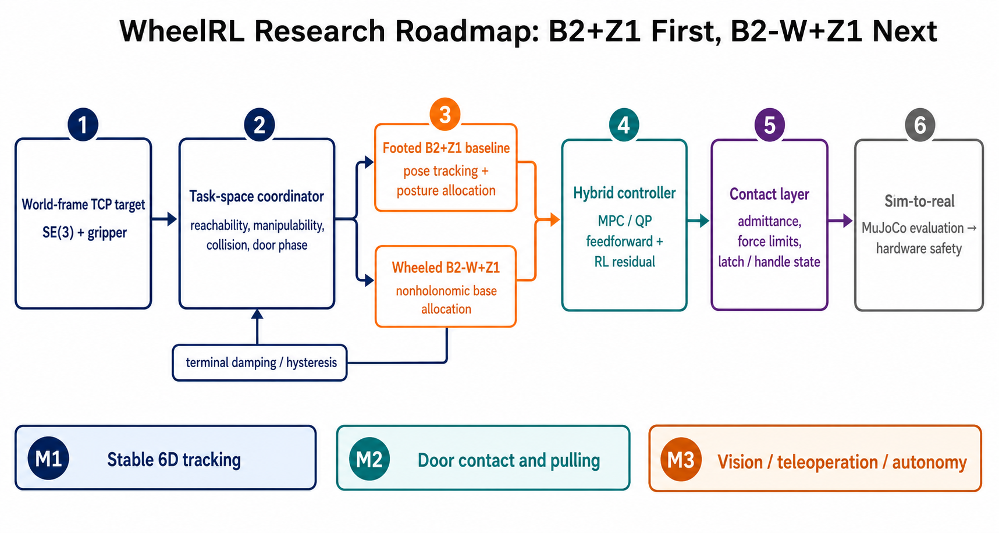

# WheelRL 研究状态与文献路线图（2026-08-28）

这是一份可复现的研究快照，记录当前 WheelRL 的实现、已经观察到的问题、与公开工作的差距，以及下一阶段 B2+Z1 / B2-W+Z1 开门研究的推荐路线。

> **2026-09-02 addendum:** MLM 与 Deep Whole-Body Control 的代码级核验、
> 最终取舍和实验机交接要求见
> [`ISAACLAB_TCP_TRACKING_HANDOFF_2026-09-02.md`](ISAACLAB_TCP_TRACKING_HANDOFF_2026-09-02.md)。
> 本文的分支/提交字段保留为 2026-08-28 的历史快照。

## 一页结论

1. **先做足式 B2+Z1 是合理的，而且现在有了很强的公开基线。** 足式版本去掉轮地非完整约束和“轮子移动/腿部姿态/机械臂”三者同时分配的难题，可以先把 6D TCP tracking、身体姿态分配、接触顺应和门任务状态机做正确。
2. **不建议把当前问题只归因于奖励函数。** 后方目标、低位目标、终点震荡和持续 base moving 同时暴露了命令表示、动作分配、终端切换、碰撞/可达性和接触模型的问题。
3. **推荐的核心结构是分层混合控制：** 世界坐标 TCP 目标 → 任务空间协调器 → 足式/轮式低层 → MPC/QP 前馈 + RL residual → 接触顺应和安全层。
4. **最值得先复现的两条足式基线：**
   - [Whole-Body Inverse Dynamics MPC](https://github.com/lukasmolnar/wb-mpc-locoman)：精确对应 Unitree B2+Z1，模型控制基线。
   - [LeggedManip Lab](https://github.com/zzzJie-Robot/LeggedManip_Lab)：B2+Z1、Isaac Lab、RSL-RL、MuJoCo sim-to-sim，学习式 WBC 基线。
5. **轮式 B2-W+Z1 仍保留为第二阶段目标。** [Arm-Constrained Curriculum](https://github.com/aCodeDog/legged-robots-manipulation) 有精确平台资产和门任务，但仓库是部分实现，不能把它当成开箱即用的最终答案。

> **Greenfield 原则：现有 WheelRL 只是 baseline，不是新系统的架构前提。** 如果统一 benchmark 证明当前控制器、训练栈或机器人模型阻碍了性能，可以替换仿真器、控制器、RL 框架和代码组织，甚至建立独立的新仓库。后续研究以任务指标和可复现性选型，不以保留已有代码量为目标。

## 当前代码快照

- 仓库：`/home/chenm/WheelRL`
- 分支：`ubuntu-4090-training`
- 提交：`df21347`（`wbc: add bounded tracking and low-reach tilt coordination`）
- 状态：快照记录时本地与 `origin/ubuntu-4090-training` 一致。

### 已完成的能力

| 模块 | 当前实现 |
|---|---|
| 机器人模型 | Unitree B2-W + Z1 + 1-DoF 夹爪，23 维动作 |
| 仿真控制 | MuJoCo 500 Hz / PD，RL policy 50 Hz |
| 交互式 WBC | 浏览器输入世界坐标 TCP `x/y/z + roll/pitch/yaw` 和夹爪目标 |
| 求解层 | 100 Hz 有界阻尼最小二乘/QP；轮滚动约束、浮动基座、TCP SE(3)、姿态和关节限位 |
| 不可达目标 | 靠近工作空间边界、关节极限或低可操作度时逐渐增加 base participation；明显不可达时底盘和机械臂同步运动 |
| 终端模式 | 目标可行且收敛后切换到强阻尼 arm-only precision，抑制底盘慢速极限环 |
| 低位目标 | 最多 14° 前倾；前腿缩短、后腿伸长；安全局部高度投影；远且低时先平移再倾斜 |
| 分层学习 | 已有 WBC servo + RL residual 实验，并加入 residual magnitude penalty |
| 门环境 | 已有独立 pull-door 场景、把手转动/门闩释放/后拉的阶段定义和训练入口 |
| 跨机器训练 | WSL 与 Ubuntu RTX 4090 独立实验、唯一 run 目录、metadata、checkpoint 迁移和 Release 分发流程 |

### 已知现象与尚未解决的问题

| 现象 | 更可能的根因 | 不能只靠什么解决 |
|---|---|---|
| TCP 到达目标慢 | 位置命令缺少显式速度/加速度轮廓；权重冲突；servo 与 policy 时标不匹配 | 单纯增大 tracking reward |
| 目标附近震荡 | 终端阻尼不足、噪声/延迟、base/arm 权重反复切换、积分/残差偏置 | 单纯提高控制增益 |
| 后方目标机械臂姿态不自然 | 缺少明确的 base yaw/back-up 规划和方向可操作度代价 | 仅依赖关节姿态 reward |
| 低位目标持续 base moving | 目标坐标和移动地基耦合；缺少足接触平面/身体姿态参考；低位模式退出条件不稳 | 继续放宽 Z 高度范围 |
| 倾斜后向前目标偏离 | 身体姿态改变后 TCP 参考、雅可比/目标投影或 base motion 没有保持一致的坐标定义 | 只调一个低位奖励权重 |
| 低位本体碰撞 | 碰撞几何、可行域和姿态规划没有进入统一约束 | 仅靠 episode collision penalty |
| 开门时可能丢把手 | 当前核心还是位姿控制，缺少末端阻抗/导纳、力限制、滑移状态和门铰链估计 | 纯 position tracking |

### 当前控制器的研究边界

当前 WBC 是仿真级运动学/速度层控制器，还没有形成真机所需的完整逆动力学和接触力控制。缺口包括：

- 摩擦锥、接触力和执行器力矩约束；
- 连续碰撞/自碰撞感知轨迹优化；
- 末端力/导纳控制和 F/T 传感器接口；
- 时延、状态估计、急停、Reference Governor/CBF 等硬件安全层；
- 对真实 Z1 安装位姿、惯量和碰撞几何的标定。

## 推翻重做时的架构选择

当前结果不够好，因此下面三条路线都应作为独立候选，通过同一个 benchmark 比较，而不是默认在现有控制器上继续打补丁。

| 路线 | 优点 | 主要风险 | 建议用途 |
|---|---|---|---|
| 全阶逆动力学 MPC | 约束、接触力和动态一致性明确；数据需求低；适合精确 tracking 和拉门 | 建模、求解器和真机状态估计成本高 | B2+Z1 的可信 model-based baseline |
| 统一 RL WBC | GPU 并行训练快；能利用身体冗余并吸收模型误差 | reward/课程敏感；终端精度和安全约束较难保证 | 学习式 baseline 和大范围动作生成 |
| **MPC/QP + constrained RL residual** | 模型层保证名义运动和约束，学习层负责纠模、抗扰和动作分配 | 系统集成和训练接口更复杂 | **推荐的最终研究架构** |

### 推荐的全新系统，而非当前代码的渐进升级

1. **重新建立机器人模型真值源。** 从官方/公开 B2+Z1 URDF、惯量、关节限位和碰撞几何开始，分别在 Pinocchio 与 MuJoCo 中做质量、质心、FK、Jacobian 和关节轴一致性测试。
2. **先建立足式 full-order baseline。** 以 `wb-mpc-locoman` 为 model-based 起点，以 LeggedManip Lab 为 RL 起点；两者只共享命令定义和 benchmark，不要求共享控制器实现。
3. **重新定义上层接口。** 输入不是一个裸 pose，而是 `world-frame SE(3) target + desired twist/limits + gripper + task phase/contact mode`。
4. **单独实现 task-space coordinator。** 负责可达性、方向可操作度、碰撞、root/base posture、前进/倒车/转身选择和模式滞回，不把这些决策隐藏在低层 tracking reward 中。
5. **低层使用逆动力学 MPC/QP。** 统一腿、身体、机械臂、接触力、摩擦和力矩约束；硬件内环仍保持 500 Hz 级别。
6. **RL 作为受限 residual。** 输出小幅 torque/position correction、motion-distribution preference 或 compliance 参数；动作幅值和变化率都有硬边界。
7. **门任务是独立上层。** 门把手、门闩、铰链和夹爪接触进入显式状态估计/阶段机；自由空间 tracking 与 contact mode 使用不同控制律。
8. **Isaac Lab 与 MuJoCo 分工。** Isaac Lab 用于 GPU 大规模训练，MuJoCo 作为独立物理引擎做 sim-to-sim 验证和交互式调试，避免只在一个仿真器中得到虚假的好结果。

### 可以保留与可以舍弃的部分

| 处理方式 | 内容 |
|---|---|
| 优先保留 | 经过校验的 B2-W/Z1/夹爪资产、门场景概念、浏览器目标输入、run metadata、checkpoint 配对流程、统一评估脚本 |
| 只作为对照 | 当前有界运动学 WBC、auto-drive、低位前倾启发式、现有 PPO tracking policy |
| 可以直接替换 | Stable-Baselines3 训练栈、reward 结构、动作空间、控制频率分层、机器人组合 XML、项目目录结构 |
| 不应继承 | 未经验证的坐标约定、碰撞排除、为了让 demo 工作而加入但缺少物理依据的阈值和特殊分支 |

### 是否新建项目

如果决定实施重构，优先新建独立分支或仓库，例如 `rebuild/b2-z1-hybrid-wbc`，并把旧 WheelRL 固定成对照组。不要一边大规模删除旧控制器、一边失去可比较的旧结果。新系统达到下列门槛后，再讨论取代旧实现：

- 固定测试集上的 tracking error、settling time 和 terminal jitter 显著优于旧系统；
- 后方、低位和不可达目标没有专门脚本化例外也能产生合理姿态；
- MuJoCo 与第二仿真后端结果一致；
- door contact 中无持续增大的接触力、无 base/arm 争抢和明显滑移；
- 所有结论可由自动 benchmark 和保存的配置复现。

## 文献检索方法

- 日期：2026-08-28。
- 数据源：arXiv cs.RO、CoRL/PMLR、RSS、ICRA、IROS、RA-L、IEEE TIE，以及论文官方项目页和 GitHub。
- 检索主题：`loco-manipulation`、`end-effector pose/twist tracking`、`motion distribution`、`manipulability`、`wheel-legged`、`door opening`、`articulated object`、`teleoperation`。
- 收录标准：必须与四足/轮足机械臂的 TCP tracking、全身动作分配、接触或门任务直接相关；优先保留有真机验证、公开代码或与 B2/Z1 平台接近的工作。
- 代码状态核验：除项目页外，还浅克隆并检查了核心仓库的机器人资产、训练入口、许可证和完成度。
- 本地开放论文：见 [papers/README.md](papers/README.md)。PDF 保存在同目录，但默认不纳入 Git，避免把仓库增大约 150 MB。

## 与 TCP tracking 最相关的方法

### 模型驱动

| 工作 | 发表 | 核心方法 | 对 WheelRL 的价值 | 代码 |
|---|---|---|---|---|
| [Whole-Body Inverse Dynamics MPC](https://arxiv.org/abs/2511.19709) | RA-L，2025 online / 2026 卷 | 全阶逆动力学、直接优化力矩、80 Hz Fatrop | **精确 B2+Z1**；足式基线首选；可提供动态可行的姿态和力前馈 | [MIT](https://github.com/lukasmolnar/wb-mpc-locoman) |
| [Unified MPC](https://arxiv.org/abs/2103.00946) | RA-L/ICRA 2021 | 统一多接触 OCP | 证明门推/拉不必拆成互不一致的腿、臂控制器 | 未找到完整对应实现 |
| [Adaptive Motion Distribution](https://doi.org/10.1109/TIE.2024.3413833) | IEEE TIE 2025 | 自适应 base/arm 权重与方向可操作度 | 直接解决“后方目标应倒车/转身，而不是扭臂” | 未找到 |
| [qm_control](https://github.com/skywoodsz/qm_control) | IROS 2024 | OCS2 MPC + WBC + compliance | 可借鉴饱和、摩擦和顺应约束；ROS1/Gazebo 栈较旧 | BSD-3，开发中 |

### 学习驱动

| 工作 | 发表 | 命令接口/关键机制 | 对当前问题的启发 | 代码 |
|---|---|---|---|---|
| [RFM WQM pose tracking](https://arxiv.org/abs/2412.03012) | RA-L 2025 | 世界坐标 6D EE pose、非线性 reward fusion、teacher-student | 与 B2-W+Z1 的目标最接近；说明统一 pose policy 可行 | 未找到控制器代码 |
| [Multi-Critic Twist Tracking](https://proceedings.mlr.press/v305/vijayan25a.html) | CoRL 2025 | EE twist；locomotion/manipulation 分离 critic | **最直接针对慢追踪和目标附近震荡**；让轨迹速度成为受控变量 | 未找到代码 |
| [MLM](https://arxiv.org/abs/2508.10538) | RA-L 2026 / arXiv 2025 | 短时域 6D TCP 轨迹、history/future prediction、adaptive task sampling | 连续轨迹与遥操作参考最强；门规划轨迹已知时先跳过预测器 | 截至 2026-09-02 未找到官方代码/数据 |
| [Deep Whole-Body Control](https://proceedings.mlr.press/v205/fu23a.html) | CoRL 2022 | unified policy、advantage mixing、online adaptation | **身体升降/倾斜协调参考**；底盘速度需另给，公开默认配置主要是 3D 位置 tracking | [参考代码](https://github.com/MarkFzp/Deep-Whole-Body-Control)；无 checkpoint |
| [RoboDuet](https://arxiv.org/abs/2403.17367) | RA-L 2025 | 两个相互作用的 locomotion/manipulation policy | 比完全统一 actor 更容易处理两个目标冲突 | [代码](https://github.com/locomanip-duet/RoboDuet) |
| [LeggedManip Lab](https://github.com/zzzJie-Robot/LeggedManip_Lab) | 软件项目 | mixed-frame EE pose + base velocity，RSL-RL PPO | **B2+Z1 足式 RL 最快起点**；需要再加 world-frame coordinator | Apache-2.0 |

### 混合模型与学习

| 工作 | 发表 | 架构 | 结论 |
|---|---|---|---|
| [RAMBO](https://arxiv.org/abs/2504.06662) | RA-L 2025 | reference generator + QP WBC torque feedforward + RL corrective feedback | 与 WheelRL 已有“WBC + residual”方向高度一致，应把 residual 限制在纠模和抗扰，而不是让它重新发明稳定控制 |
| [Safe Combined Control](https://arxiv.org/abs/2603.02443) | ICRA 2026 | arm admittance + RL locomotion + Reference Governor | 开门阶段需要的安全接触层；位姿误差不应直接转换为无限接触力 |
| [Sumo](https://arxiv.org/abs/2604.08508) | arXiv 2026 | test-time sample-based MPC steering pretrained WBC policy | 适合在不重训底层的情况下规划拉门/绕门动作；公开实现目前不是 B2/Z1 |

## 2026 年最新前沿及其意义

| 工作 | 状态（截至 2026-08-28） | 新意 | 对项目的优先级 |
|---|---|---|---|
| [PAKE](https://arxiv.org/abs/2607.11041) | arXiv；未找到代码 | 用 Kinematic Normalizing Flow 生成可行参考，高层在潜空间选择冗余解 | 高：可用于自然姿态和大工作空间，但复现成本高 |
| [TA-WBC](https://arxiv.org/abs/2605.31343) | arXiv；未找到代码 | 在足接触平面定义 EE 采样，感知地形并蒸馏双策略 | 高：直接对应低位/倾斜后目标漂移 |
| [FT-WBC](https://arxiv.org/abs/2606.24466) | arXiv；代码仓库仅占位 | arm policy 给出 EE 动作和 base posture，再由安全姿态模块修正 | 中高：说明应显式输出/规划身体姿态，而非让底盘只跟 TCP 误差跑 |
| [TAC-LOCO](https://arxiv.org/abs/2607.10132) | **投稿 CoRL 2026，未确认录用**；无代码 | 触觉 latent 联合控制腿、臂、夹爪，降低夹持力和滑移 | 中：真机拉门时重要，仿真 TCP 基线阶段不先做 |
| [OpenHEART](https://arxiv.org/abs/2603.05830) | ICRA 2026；无代码 | 紧凑几何特征 + articulation estimator + 自动重试 | 高：门把手/铰链未知时的上层能力 |
| [Video2DoorTraversal](https://arxiv.org/abs/2608.20251) | arXiv 2026-08；代码 coming soon | 单视频构建 door twin，生成示范并训练双深度策略 | 高但后置：是推门穿越；论文把拉门列为未来工作 |
| [TONAV](https://arxiv.org/abs/2608.22296) | arXiv 2026-08；learning code coming soon | 导航到 manipulation-ready base pose，并联合位置/速度 chunk | 高：直接补上“到附近”与“可操作姿态”之间的缺口 |

## 对当前方案的具体改进

### 1. 把单个 pose target 改成带速度轮廓的 SE(3) 命令

保留用户输入的最终 `T_world_tcp*`，但协调器内部生成：

- 平滑位置/姿态参考；
- 期望线速度和角速度（twist）；
- 有界加速度/jerk；
- 到达区间内的速度收敛和滞回。

这比只给 pose error 更容易区分“还要快速移动”和“已经到点，应该停稳”。Multi-Critic 的 twist formulation 是最直接的论文依据。

### 2. 显式做 base/arm/posture 分配

协调器每个周期计算候选动作，不直接让 TCP 误差驱动底盘：

1. arm-only；
2. base yaw + arm；
3. 前进/倒车 + arm；
4. body height/pitch/roll + arm；
5. 足式重心/落足调整 + arm。

代价至少包含 TCP 误差、方向可操作度、关节限位、碰撞距离、base 位移、姿态变化和切换代价。候选之间要有滞回；后方目标应优先产生“倒车/转身”方案，而不是把 Z1 逼进低可操作度姿态。

### 3. 终端稳定采用独立控制模式

建议状态机：`TRANSIT → APPROACH → SETTLE → CONTACT`。

- `TRANSIT`：较快、允许 base participation；
- `APPROACH`：降低 twist 和 jerk；
- `SETTLE`：高阻尼、冻结不必要的 base 目标、残差动作衰减；
- `CONTACT`：切换导纳/力限制，不能继续把位置误差当成自由空间运动。

进入/退出阈值必须不同，并用连续时间窗口确认，避免在目标边界反复切换。

### 4. RL 的职责收缩为 residual 和动作分配

建议策略输出：

- 小幅 `Δq` / `Δτ` residual；
- base posture/velocity preference；
- motion-distribution weight；
- contact compliance parameter。

模型控制负责约束和名义跟踪。奖励包括 tracking、twist、terminal jitter、残差能量、base travel、manipulability、碰撞裕度和接触稳定性；奖励不应替代硬约束。

### 5. 低位目标先在足式 B2+Z1 上建立正确基线

足式版本可用前腿屈曲、后腿伸展、身体 pitch 和落足重排扩大工作空间。关键是把 EE 目标相对足接触平面/稳定世界参考表达，而不是随 base pitch 改变的错误局部参考。TA-WBC 的 foot-contact-plane 思路应作为实现和消融重点。

### 6. 开门不是单纯 TCP tracking，但必须有可靠 TCP/control interface

开门所需能力分层如下：

1. 到达预抓取 pose；
2. 对准并闭合夹爪；
3. 旋转把手达到门闩阈值；
4. 保持抓持和顺应，沿估计圆弧/铰链方向拉门；
5. 同时把 base 移到新的 manipulation-ready configuration；
6. 必要时重抓或退出重试。

因此不需要追求任意高速轨迹的极限精度才开始门任务，但至少要达到：自由空间稳定收敛、接触前低速无震荡、base 与 arm 不互相打架、夹持后能以有限接触力跟随门运动。

## 推荐实施顺序

### M0：先建立可量化基准（1 个短迭代）

- 固定 30–50 个 TCP 命令：前/侧/后、远/近、高/低、姿态变化和连续轨迹。
- 自动记录平均/95% pose error、settling time、overshoot、终端 TCP 速度 RMS、base travel、碰撞、关节限位裕度、solve time。
- 保存当前 `df21347` 结果，作为所有后续方法的基线。

### M1：足式 B2+Z1 tracking 基线

- 路线 A：跑通 LeggedManip Lab 的 `B2-Z1-WBC`，补 world-frame coordinator 和统一 benchmark。
- 路线 B：跑通 ETH `wb-mpc-locoman` 的 B2+Z1 仿真，将其作为 model-based teacher/baseline。
- 加入 twist reference、terminal state machine、base posture allocation 和 contact-plane command。
- 先不加门、不加视觉；目标是稳定、自然、可测量的 6D tracking。

### M2：旋转把手 + 拉门接触控制

- 修正门把手碰撞、门闩阈值、铰链阻尼/摩擦和夹爪接触。
- 引入导纳/阻抗或力限制；仿真中使用接触 wrench，真机预留腕部 F/T。
- 使用显式阶段机训练/评估；先 privileged state，后视觉。

### M3：迁回 B2-W+Z1

- 上层世界目标、twist 生成、door FSM、contact layer 保持不变。
- 只替换 lower-body allocator：足式落足/姿态 → 轮式 yaw/forward/back + leg height/tilt。
- 用 Arm-Constrained Curriculum 的约束与 curriculum 思路，但不直接继承其旧 Isaac Gym 工程结构。

### M4：感知、遥操作和自主化

- 遥操作仍输出 6D EE pose/twist + gripper；低层 WBC 必须继续存在。
- 用 TONAV 式 manipulation-ready navigation 衔接门前定位。
- 等 Video2DoorTraversal/OpenHEART 代码开放后再评估视觉门模型和 articulation estimator。

## 统一评估协议

### TCP tracking

- 平均、95% 和最大位置/姿态误差；
- 10–90% rise time、settling time、overshoot；
- 收敛后 2 秒的 TCP 速度/角速度 RMS；
- base 位移与 yaw、身体 pitch/roll、高度变化；
- 最小关节裕度、最小碰撞距离、可操作度；
- 控制能量、动作变化率、QP/MPC solve time 和 deadline miss。

### 开门

- reach、grasp、handle-turn、latch-release、door-pull、complete success 分阶段成功率；
- 把手角度、门角度、完成时间；
- 夹爪滑移、重抓次数、接触力峰值/RMS；
- base 与门碰撞、跌倒、关节/力矩/摩擦约束违规；
- 不同门把手高度、铰链方向、门阻尼、摩擦、视觉误差和执行延迟下的鲁棒性。

## 建议的论文研究假设

1. **Twist-aware tracking** 比纯 pose reward 显著降低 settling time 和终端震荡。
2. **显式可操作度/碰撞感知的动作分配** 比隐式 RL reward 更稳定地处理后方和低位目标。
3. **MPC/QP feedforward + constrained RL residual** 在 tracking、鲁棒性和 sim-to-real 之间优于纯模型或纯 RL。
4. **足接触平面命令表达** 能减少身体倾斜和移动时的世界坐标 TCP 漂移。
5. **manipulation-ready navigation + velocity chunk/contact control** 比“导航到附近后停止，再做机械臂操作”提高门任务成功率。

这些假设可以自然组成论文消融：`pose-only`、`pose+twist`、`+allocation`、`+hybrid residual`、`+contact layer`，而不是只比较不同 reward 权重。

## 开源复现优先级

| 等级 | 项目 | 建议 |
|---|---|---|
| A | `wb-mpc-locoman` | 立即作为 B2+Z1 model-based benchmark；平台精确、代码完整、MIT |
| A | `LeggedManip_Lab` | 立即作为 B2+Z1 RL benchmark；需锁定 Isaac Lab 版本和训练配置 |
| A- | `RAMBO` | 复用架构思想和部分代码；非 B2/Z1，且非商用许可证 |
| B+ | `legged-robots-manipulation` | 提取 B2-W+Z1 资产、约束和 curriculum；部分实现且无顶层许可证 |
| B | `qm_control` | 参考 MPC/WBC/compliance；ROS1/OCS2 工程迁移成本较高 |
| B | `Sumo` | 参考 test-time planner 和门任务评估；机器人与低层 policy 不匹配 |
| C | RFM / Multi-Critic / PAKE / TA-WBC | 论文思想很重要，但需要自行重实现 |
| C | OpenHEART / Video2DoorTraversal / TONAV | 任务层高度相关，当前主代码未完全公开，应持续监控 |

## 本次快照不包含的工作

- 没有把尚未发表/尚未开放的项目描述为可复现。
- 没有把 2026 年“投稿 CoRL”的工作描述为已录用。
- 没有把 humanoid-only 研究混入核心四足控制基线；只有控制抽象可直接迁移时才引用。
- 没有宣称当前 WheelRL 已经达到论文结果；需要先跑统一 benchmark 才能比较。
